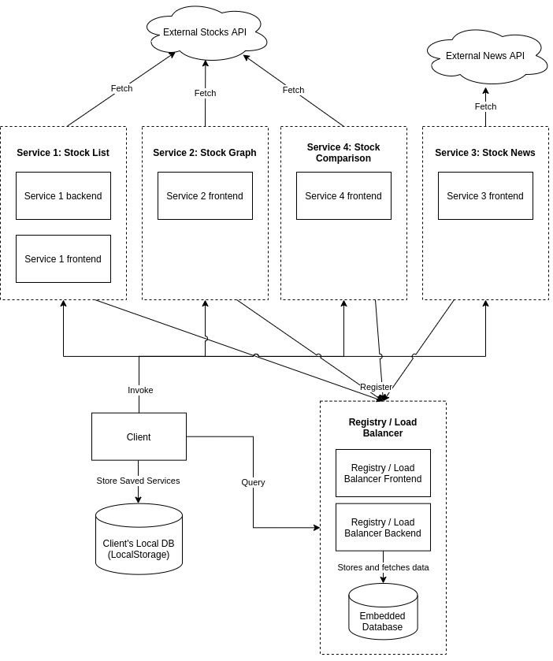

# StockTracker

Access live version: [StockTracker](http://ec2-3-144-157-84.us-east-2.compute.amazonaws.com:8080/)

This app was created for a Software Architecture course. It uses a service-oriented architecture where services can be added or removed at runtime. There are four stocks-related services and a registry to control them.

Registry:

- [Registry (README)](/registry) by Caio Coelho.

Services:

- [Stock Comparison (README)](/services/stock_comparison) by Caleb Sutherland.
- [Stock Graph (README)](/services/stock_graph) by Ryan Harlen.
- [Stock List (README)](/services/stock_list) by Jack Hillier.
- [Stock News (README)](/services/stock_news) by Daniel Wakefield.

### How to run this app

To run the app, simply build the containers and run them. The following API key must be passed to `docker-compose up`: `YAHOO_FINANCE_API_KEY`. If you were provided with an `.env` file, place it at the root of the repo and it should take care of the environment variables. 

    sudo docker-compose build
    sudo docker-compose up -d

If the environment variable is not read properly, use `YAHOO_FINANCE_API_KEY=<api_key_here> sudo docker-compose up -d` instead. You will know it's not working if the Stock List app isn't showing.

To access the service, go to http://localhost:80. The API is hosted on port 3000 by default.

Once the app is running, register any or all services with API calls. You must also pass an `API-Key` in the POST requests for API-Key authentication. The default environment variable is `API_KEY=CS4471Group6`.

Register all four services by running

```
    curl --location --request POST 'http://localhost:3000/service/add' \
    --header 'API-Key: CS4471Group6' \
    --header 'Content-Type: application/json' \
    --data-raw '{
        "path": "http://localhost:81",
        "displayName": "Stock List",
        "active": true,
        "port": 81
    }'
```

```
    curl --location --request POST 'http://localhost:3000/service/add' \
    --header 'API-Key: CS4471Group6' \
    --header 'Content-Type: application/json' \
    --data-raw '{
        "path": "http://localhost:82",
        "displayName": "Stock Comparison",
        "active": true,
        "port": 82
    }'
```

```
    curl --location --request POST 'http://localhost:3000/service/add' \
    --header 'API-Key: CS4471Group6' \
    --header 'Content-Type: application/json' \
    --data-raw '{
        "path": "http://localhost:83",
        "displayName": "Stock Graph",
        "active": true,
        "port": 83
    }'
```

```
    curl --location --request POST 'http://localhost:3000/service/add' \
    --header 'API-Key: CS4471Group6' \
    --header 'Content-Type: application/json' \
    --data-raw '{
        "path": "http://localhost:84",
        "displayName": "Stock News",
        "active": true,
        "port": 84
    }'
```

You can also use Postman or your preferred API Platform.
Note that there is a volume for the database, so if you restart the app you don't need to re-register all services.

To add, remove, activate, or deactivate services, please see the [Registry Readme](/registry)

### Architecture

The primary purpose of this project was to learn & practice software architecture and the SOA pattern, not to make an industry-disrupting stock app per se :). Here is an overview of our system.


